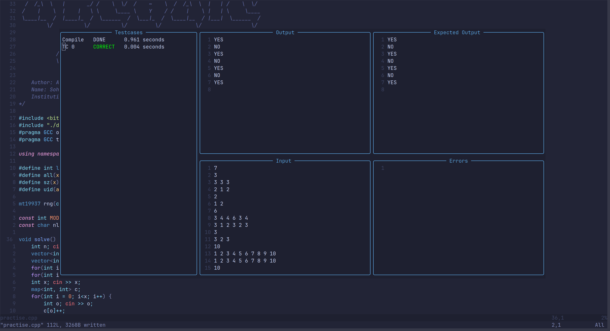
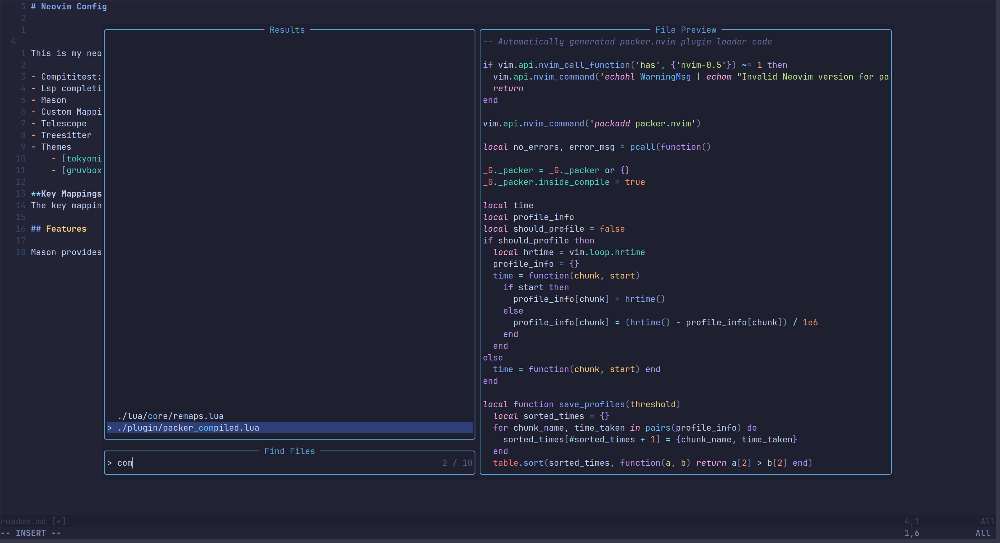

# Neovim Config

This is my neovim configuration settings for C++ development and competitive programming

- Compititest
- Lsp completions
- Mason
- Custom Mappings
- Telescope
- Treesitter
- Themes
    - [tokyonight](https://github.com/folke/tokyonight.nvim)
    - [gruvbox](https://github.com/morhetz/gruvbox)

**Key Mappings**
The key mappings can be found [here](https://github.com/Archaic-Mage/nvim/blob/main/lua/core/remaps.lua). You can edit them accordingly. 

## Screenshots

### Compititest

### Fuzzy Search (Telescope)

